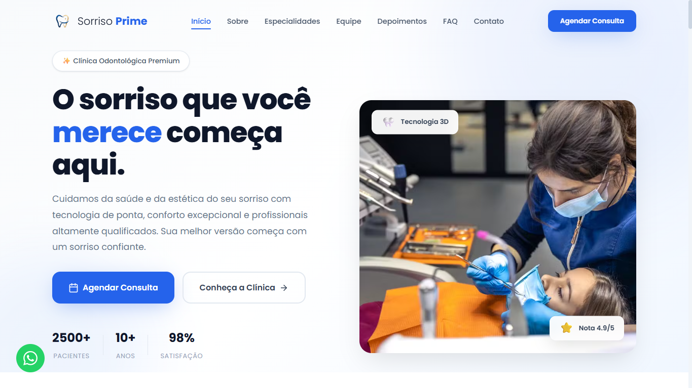

# 🦷 Sorriso Prime

Site institucional desenvolvido para uma clínica odontológica fictícia, criado com foco em design moderno, alta performance, responsividade e uma excelente experiência do usuário.

O projeto foi desenvolvido como parte do meu portfólio, simulando um site profissional para uma clínica real, com o objetivo de transmitir confiança, credibilidade e facilitar o contato entre pacientes e a clínica.

OBS: Algumas Imagens Usadas Foram Geradas por Inteligência Artificial.

---

## 📸 Preview



---

## 🚀 Demonstração

🔗 **Acesse o projeto online:**

https://sorrisoprimesite.vercel.app

---

## ✨ Funcionalidades

* ✅ Layout moderno e totalmente responsivo
* ✅ Navegação suave entre as seções
* ✅ Menu fixo com efeito ao rolar a página
* ✅ Hero Section com chamada para ação
* ✅ Seção institucional sobre a clínica
* ✅ Especialidades odontológicas
* ✅ Galeria de imagens
* ✅ Antes e Depois
* ✅ Equipe de profissionais
* ✅ Processo de atendimento
* ✅ Carrossel de depoimentos
* ✅ FAQ interativo
* ✅ Formulário de contato
* ✅ Botão de WhatsApp
* ✅ Estrutura otimizada para SEO

---

## 🛠️ Tecnologias utilizadas

* HTML5
* CSS3
* JavaScript

---

## 📁 Estrutura do projeto

```text
sorriso-prime/
├── index.html
├── css/
│   └── style.css
├── js/
│   └── script.js
└── assets/
    └── images/
        ├── logo.png
        ├── favicon.png
        ├── hero-dentista.jpg
        ├── clinica.jpg
        ├── og-image.jpg
        ├── galeria/
        │   ├── galeria1.jpg
        │   ├── galeria2.jpg
        │   ├── galeria3.jpg
        │   ├── galeria4.jpg
        │   ├── galeria5.jpg
        │   └── galeria6.jpg
        ├── resultados/
        │   ├── resultado1.jpg
        │   ├── resultado01.jpg
        │   ├── resultado2.jpg
        │   ├── resultado02.jpg
        │   ├── resultado3.jpg
        │   └── resultado03.jpg
        ├── equipe/
        │   ├── dra-anabeatriz.jpg
        │   ├── dr-carloseduardo.jpg
        │   ├── dra-marianasilva.jpg
        │   └── dr-rodrigolima.jpg
        └── depoimentos/
            ├── paciente1.jpg
            ├── paciente2.jpg
            ├── paciente3.jpg
            ├── paciente4.jpg
            ├── paciente5.jpg
            └── paciente6.jpg
```

---

## 📱 Responsividade

O projeto foi desenvolvido para funcionar perfeitamente em:

* 💻 Desktop
* 💼 Notebook
* 📱 Smartphones
* 📲 Tablets

---

## 👨‍💻 Autor

Desenvolvido por **m4chado7**.

- @m4chado7.web em todas as redes sociais.
- github.com/m4chado7

Caso tenha interesse em um site profissional para o seu negócio, entre em contato.